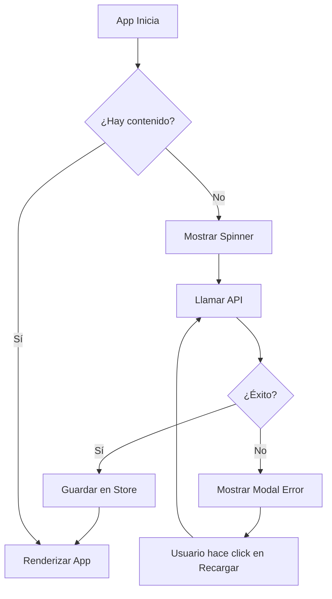

# Pulgarpedia - Configuración del API

## Descripción

Pulgarpedia ahora consume todo el contenido de categorías y lugares turísticos desde un API centralizado.

## Endpoint del API

**URL**: `https://private-d21258-herbertayala.apiary-mock.com/pulgarpedia-content`

**Método**: GET

**Respuesta esperada**:

```json
{
  "categories": [
    {
      "id": "nature-adventure",
      "name": "Naturaleza y Aventura",
      "icon": "🏞️",
      "description": "Volcanes, lagos, cascadas..."
    }
  ],
  "places": [
    {
      "placeId": "NA-001",
      "categoryId": "nature-adventure",
      "header": { ... },
      "gallery": [ ... ],
      "generalHistorySection": { ... },
      "serviceLogisticSection": { ... },
      "premiumSection": { ... }
    }
  ]
}
```

## Arquitectura Implementada

### 1. **Tipos TypeScript** (`src/types/content.ts`)

Define las interfaces para:

- `PulgarpediaContent`: Estructura principal con categorías y lugares
- `ContentState`: Estado global del contenido en Zustand

### 2. **Servicio API** (`src/utils/contentApi.ts`)

Funciones para interactuar con el API:

- `fetchPulgarpediaContent()`: Obtiene todo el contenido
- `getPlaceById()`: Busca un lugar por ID
- `getPlacesByCategory()`: Filtra lugares por categoría
- `getCategoryById()`: Obtiene una categoría específica

**Características**:

- Timeout de 10 segundos
- Manejo de errores específicos (timeout, servidor, red)
- Validación de estructura de datos

### 3. **Store Global** (`src/stores/contentStore.ts`)

Zustand store para manejar el estado del contenido:

- `content`: Contenido cargado (null hasta que se carga)
- `isLoading`: Indicador de carga
- `error`: Mensaje de error si falla
- `loadContent()`: Función para cargar contenido
- `retryLoad()`: Función para reintentar carga

### 4. **Componente ErrorModal** (`src/components/ErrorModal.tsx`)

Modal Material-UI que se muestra cuando:

- El API no responde
- Hay error de conexión
- Timeout o cualquier otro error

**Características**:

- No se puede cerrar con ESC o click fuera
- Botón de "Recargar" para reintentar
- Muestra spinner mientras recarga
- Diseño amigable con iconos y mensajes claros

### 5. **Integración en `_app.tsx`**

El componente principal ahora:

1. Carga el contenido al iniciar la app
2. Muestra spinner de carga inicial
3. Muestra modal de error si falla
4. Solo renderiza la app cuando hay contenido disponible

## Flujo de Carga



## Uso en Componentes

Para usar el contenido en cualquier componente:

```typescript
import { useContentStore } from "../stores/contentStore";

function MiComponente() {
  const { content } = useContentStore();

  // Acceder a categorías
  const categories = content?.categories;

  // Acceder a lugares
  const places = content?.places;

  // Filtrar por categoría
  const naturePlaces = content?.places.filter(
    (place) => place.categoryId === "nature-adventure"
  );

  return <div>...</div>;
}
```

O usar las funciones helper:

```typescript
import { useContentStore } from "../stores/contentStore";
import { getPlaceById, getPlacesByCategory } from "../utils/contentApi";

function DetallePlace({ placeId }: { placeId: string }) {
  const { content } = useContentStore();

  if (!content) return <div>Cargando...</div>;

  const place = getPlaceById(content, placeId);

  return <div>{place?.header.title}</div>;
}
```

## Manejo de Errores

La aplicación maneja automáticamente:

- **Timeout**: "Tiempo de espera agotado al cargar el contenido"
- **Error de servidor**: "Error del servidor: 500"
- **Sin conexión**: "No se pudo conectar con el servidor"
- **Otros errores**: "Error al cargar el contenido de Pulgarpedia"

## Archivo content.json Local

El archivo `src/data/content.json` contiene todos los datos unificados:

- **39 lugares turísticos** en total
- **5 categorías**: Naturaleza, Playas, Pueblos, Gastronomía, Festividades
- Cada lugar con información completa:
  - Header con título y descripción
  - Galería de imágenes
  - Historia y cultura
  - Ubicación con coordenadas GPS
  - Logística y costos
  - Recomendaciones premium

## Testing

Para probar el manejo de errores:

1. **Simular error de red**: Apagar internet y recargar
2. **Simular timeout**: Cambiar timeout a 1ms en `contentApi.ts`
3. **Simular error de servidor**: Cambiar URL del API a una inválida

## Próximos Pasos

- [ ] Implementar caché del contenido en localStorage
- [ ] Agregar modo offline con fallback a JSON local
- [ ] Implementar actualización automática periódica
- [ ] Agregar analytics de errores de carga
